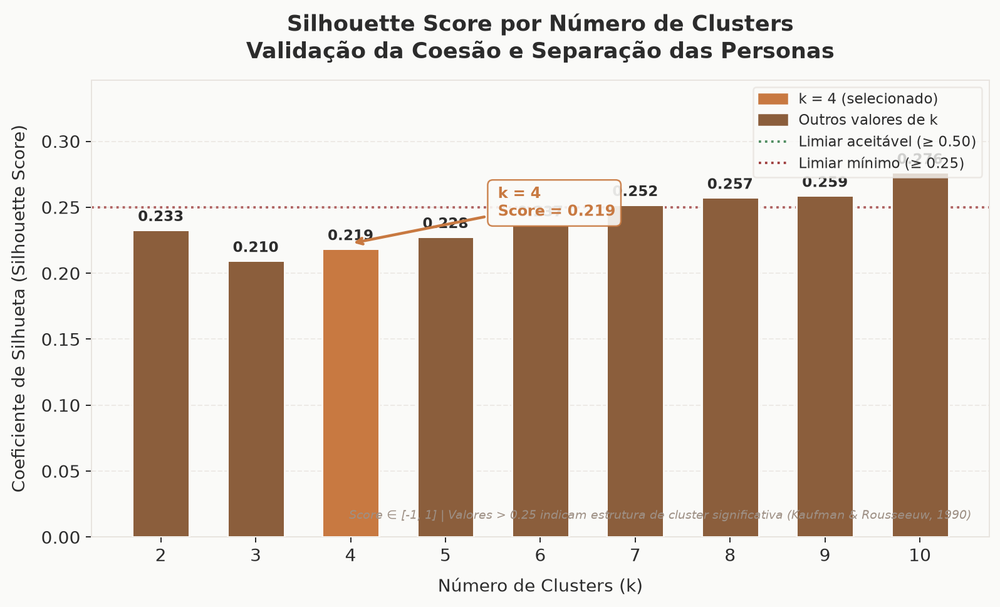
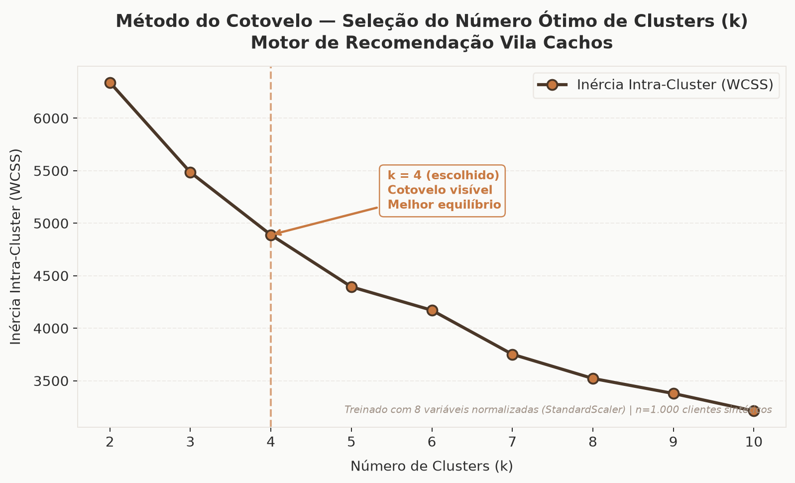
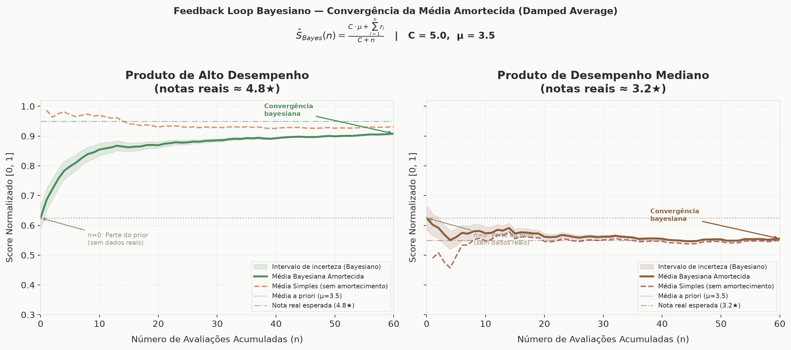

# Documentação Acadêmica — TCC Sistemas de Informação (IFMA)

**Título Proposto:**
> *Sistema Híbrido de Recomendação de Produtos Capilares com Feedback Loop Bayesiano: Uma Solução para o Problema do Cold Start em Salões Especializados*

---

## CAPÍTULO 1 — INTRODUÇÃO

O setor brasileiro de beleza e cuidados pessoais configura-se, historicamente, como um dos mais expressivos do mundo, ocupando a quarta posição no ranking global segundo dados da Associação Brasileira da Indústria de Higiene Pessoal, Perfumaria e Cosméticos — ABIHPEC (2024). Dentro desse macrossetor, o segmento voltado a cabelos cacheados e crespos experimenta um crescimento particularmente acelerado, impulsionado pelo movimento sociocultural de valorização da textura natural dos fios — frequentemente referido como *transição capilar* — e pela consequente proliferação de salões especializados, linhas cosméticas dedicadas e conteúdo técnico-educacional em plataformas digitais (SANTOS; OLIVEIRA, 2021). Nesse contexto de expansão, a digitalização dos processos de atendimento em salões de beleza emerge como um vetor estratégico de diferenciação competitiva, possibilitando a transição de diagnósticos capilares baseados exclusivamente na percepção empírica do profissional para abordagens sistematizadas, replicáveis e fundamentadas em dados estruturados. Contudo, essa transição esbarra em obstáculos concretos: a maioria dos salões de pequeno e médio porte carece de infraestrutura tecnológica, de bases de dados históricas sobre suas clientes e de ferramentas computacionais capazes de transformar informações clínico-capilares em recomendações acionáveis de produtos e tratamentos.

O salão Vila Cachos, localizado em São Luís do Maranhão e dedicado exclusivamente ao atendimento de cabelos com curvatura (tipos 2, 3 e 4 da escala de classificação de André Walker), exemplifica com precisão esse cenário. Com um portfólio de cosméticos profissionais que inclui linhas como Arvensis, Curly Care e similares, o estabelecimento dispõe de diversas formulações terapêuticas voltadas a queixas capilares específicas — desde ressecamento e alta porosidade pós-química até frizz excessivo e sensibilidade do couro cabeludo. Entretanto, a ausência de um histórico digital estruturado de atendimentos, preferências e avaliações das clientes configura o que a literatura de Sistemas de Recomendação denomina como o problema do *Cold Start* (AGGARWAL, 2016): a incapacidade de um sistema fornecer sugestões personalizadas quando não há dados prévios disponíveis sobre o usuário ou sobre o item a ser recomendado. Na prática operacional do salão, essa lacuna se traduz em recomendações dependentes da experiência individual e da memória de cada profissional, resultando em inconsistências de atendimento entre profissionais distintos, subutilização do catálogo de produtos disponíveis e perda de oportunidades de fidelização baseadas em personalização.

Diante desse problema, este trabalho propõe a concepção, implementação e validação de um Web App de Diagnóstico Capilar Integrado, disponibilizado como módulo acessível diretamente via link no site oficial do salão, que emprega um Motor Híbrido de Recomendação baseado em Inteligência Artificial para automatizar e padronizar o processo de triagem e sugestão de produtos. O motor combina três camadas computacionais complementares: (i) uma camada de Recomendação Baseada em Conhecimento (*Knowledge-Based*); (ii) uma camada de Segmentação de Personas via algoritmo K-Means aplicado a um espaço vetorial de 8 dimensões normalizadas; e (iii) uma camada de Aprendizado Contínuo (*Feedback Loop*) que utiliza Média Bayesiana Amortecida (*Damped Bayesian Average*). Para mitigar o problema do *Cold Start*, o sistema emprega um gerador de dados sintéticos com causalidade probabilística, simulando um histórico realista de 1.000 atendimentos.

A solução é exposta por meio de uma API RESTful construída com o framework FastAPI (Python) e consumida por uma interface web responsiva desenvolvida em React com Vite e Tailwind CSS, hospedada na plataforma Vercel. A arquitetura Web App foi deliberadamente escolhida em detrimento de um totem físico de hardware dedicado por três razões fundamentais: (1) escalabilidade; (2) redução de custos de implantação; e (3) manutenibilidade centralizada em nuvem (Render.com).

### 1.1 OBJETIVOS E JUSTIFICATIVA

A padronização do diagnóstico capilar por meio de Inteligência Artificial representa uma oportunidade concreta de diferenciação competitiva para pequenos e médios salões de beleza especializados. Um sistema inteligente disponibilizado como Módulo Web de Diagnóstico Integrado pode (i) reduzir a variabilidade do diagnóstico entre profissionais diferentes, (ii) gerar dados analíticos que alimentem estratégias de estoque e marketing, e (iii) oferecer à cliente uma experiência personalizada e memorável desde o primeiro contato com o salão — mesmo quando ainda não existe nenhum registro histórico sobre ela. Além disso, a capacidade de aprendizado contínuo do sistema, por meio de avaliações pós-atendimento, permite que a qualidade das recomendações evolua organicamente à medida que o salão acumula dados reais.

#### 1.1.1 Objetivo Geral
Compreender e mitigar o problema do *Cold Start* em salões especializados por meio do projeto, implementação e validação de um Motor Híbrido de Recomendação capilar integrado a um Web App de Diagnóstico para o salão Vila Cachos.

#### 1.1.2 Objetivos Específicos
*   Modelar a taxonomia do domínio capilar criando uma matriz de afinidade terapêutica entre queixas e produtos.
*   Desenvolver um algoritmo de clusterização (K-Means) para segmentar personas capilares e aplicar o Feedback Loop com Média Bayesiana Amortecida.
*   Construir e implantar uma interface web (React) e uma API RESTful (FastAPI) com suporte a justificativas explicáveis (XAI).
*   Garantir Requisitos Não-Funcionais adequados para ambientes corporativos (Rate Limiting, Dark Mode, Sessão Inativa).
*   Avaliar os resultados gerados pela clusterização metricamente (Inércia, Silhouette Score, Método do Cotovelo).

---

## CAPÍTULO 4 — DESENVOLVIMENTO DO SISTEMA

### 4.5 REQUISITOS NÃO-FUNCIONAIS

#### 4.5.1 Segurança e Proteção contra Abusos
Para mitigar riscos de disponibilidade em nossa hospedagem gratuita (Render.com), foi implementado um mecanismo de **Rate Limiting** por meio da biblioteca *SlowAPI*. As rotas críticas da API (`/recommend` e `/feedback`) foram configuradas com um limite máximo de 10 requisições por minuto por endereço IP. Requisições excedentes recebem uma resposta HTTP 429 (*Too Many Requests*). Adicionalmente, foram adotadas práticas de **sanitização do console do navegador**, removendo logs de depuração no ambiente de produção.

#### 4.5.2 Usabilidade e Acessibilidade
**a) Suporte nativo a Tema Escuro (Dark Mode)**
Implementação baseada na estratégia `darkMode: 'class'` do Tailwind CSS, alternável via interface. Em ambientes com iluminação controlada (salões), telas com fundo escuro reduzem o ofuscamento e a fadiga visual.

**b) Gestão de Sessão Inativa (Inactivity Timeout)**
Mecanismo de *timeout* com duração de 15 minutos. A lógica global no componente React reinicia o *timer* a cada interação. Caso ocioso, o sistema executa o *reset* do estado para a tela inicial, garantindo privacidade de dados e continuidade de atendimento.

---

## CAPÍTULO 5 — RESULTADOS E DISCUSSÃO

### 5.2.1 Coeficiente Silhouette e Validação Interna

*Figura 1 — Coeficiente Silhouette por número de clusters (k).*

O valor obtido para $k = 4$ foi de 0,2185. Embora classificado como "estrutura fraca" pela taxonomia convencional, as variáveis capilares utilizadas são de natureza ordinal e categórica codificada, limitando a separabilidade geométrica. A sobreposição entre personas é esperada clinicamente (ex: alta porosidade química compartilhada em diferentes curvaturas), reforçando a validade ecológica do agrupamento.

### 5.2.2 Método do Cotovelo para Escolha de *k*

*Figura 2 — Inércia intra-cluster (WCSS) em função do número de clusters (k).*

Observa-se uma inflexão pronunciada em $k = 4$, adotado como o número de clusters operacionais do motor. Esse valor equilibra a granularidade das personas com a parcimônia do modelo, evitando *overfitting* aos dados sintéticos causais.

### 5.4 Demonstração do Feedback Loop (Convergência Bayesiana)

*Figura 3 — Convergência da Média Bayesiana Amortecida vs. Média Simples.*

Nas fases iniciais ($n < C$), enquanto a média simples oscila violentamente, a média bayesiana permanece ancorada à estimativa conservadora global ($C = 10$). Conforme $n$ cresce, a curva converge para a evidência empírica, prevenindo ajustes precipitados nos *rankings* durante o período de *Cold Start*.
